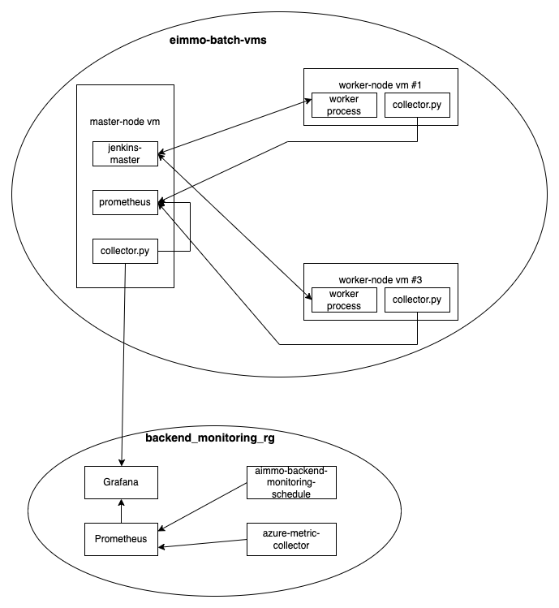

# PrometheusCollector

## System 구성도



## Install
```shell
aimmodev@eimmo-batch-vms-worker3:~/$sudo mkdir -p /opt/collector
aimmodev@eimmo-batch-vms-worker3:~/$sudo cp ./bin/collector /opt/collector
aimmodev@eimmo-batch-vms-worker3:~/$sudo su - && cd /opt/collector
aimmodev@eimmo-batch-vms-worker3:~/bin$ sudo su -
root@eimmo-batch-vms-worker2:/opt/collector$ apt install python3.8-venv gcc python3-dev
root@eimmo-batch-vms-worker2:/opt/collector$ python -m venv venv
root@eimmo-batch-vms-worker2:/opt/collector$ source venv/bin/activate
root@eimmo-batch-vms-worker2:/opt/collector$ python -m pip install pip==9.0.3
root@eimmo-batch-vms-worker2::opt/collector$ pip install -r requirements.txt
```

## Regist as daemon
```shell
root@eimmo-batch-vms-worker2::opt/collector$ cp collector.service /etc/systemd/system/
root@eimmo-batch-vms-worker2:/etc/systemd/system# systemctl daemon-reload
root@eimmo-batch-vms-worker2:/etc/systemd/system# systemctl enable collector
root@eimmo-batch-vms-worker2:/etc/systemd/system# systemctl start collector
```

## When you send slack message
```shell
SLACK_API_TOKEN=abcdefghijklmn python collector_cron.py
```